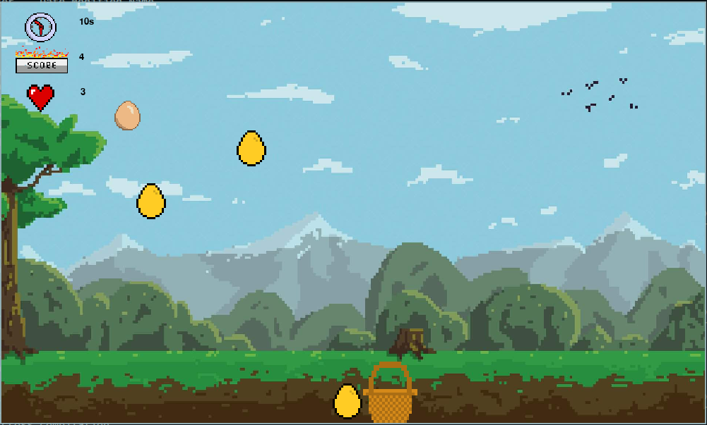
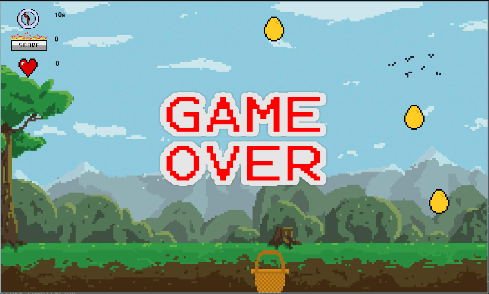

# CatchEggs

A simple game in Python using the Pygame library.

## Table of Contents

- [Description](#description)
- [Screenshots](#screenshots)
- [Installation](#installation)
- [Usage](#usage)
- [Whats New?](#whats-new)
- [Dependencies](#dependencies) 
- [Contributing](#contributing)
- [License](#license)

## Description

Eggs are falling from the sky!. Can you catch it?.

## Screenshots

### After the game is launched

### During gameplay

### Game over

## Installation

- Clone this repo using the command `git clone https://github.com/tmpstpdwn/CatchEggs` on you terminal or cmd
- open the folder `CatchEggs` and just run `main.py` file. 
- thats it
- Enjoy

## usage 

- There is a basket at the bottom of the screen
- the basket can be controlled using `left`, `right` arrow keys.
- the objective is to catch eggs that are falling from the sky.
  , score max points in min time without loosing much of life.
- Every time when you fail to catch an egg , one of your lives will be lost
- you have 5 lives in total
- golden egg is worth 2 pts and the other one just one pt.

## Whats new?

- Nothing.

## Dependencies

- `python3` is required
- `pygame` is the only external package required to installed if not already installed
- Other packages used are part of the standard library such as
    - `random`
    - `os`
    - `time`

## Contributing

Contributions are welcome! Please fork the repository and submit a pull request with your changes. For major changes, please open an issue first to discuss what you would like to change.

## License

This project is licensed under the GNU General Public License v3.0. See the [LICENSE](LICENSE) file for details.
